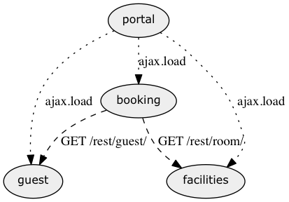
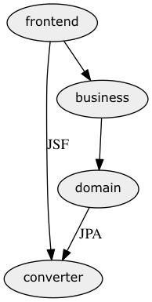
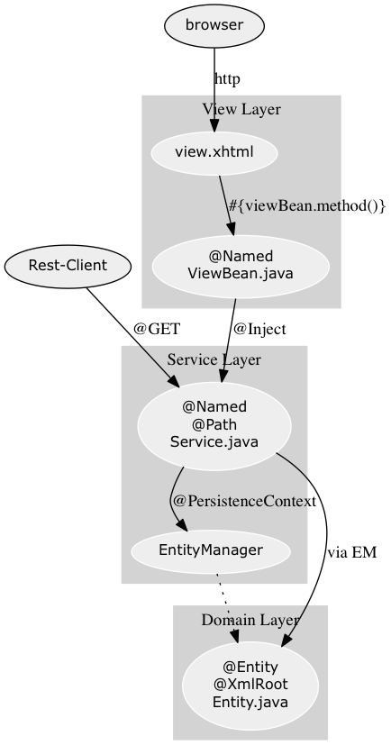

# JEE7 Demo and Quickstart

This project shows some basic JEE7 technologies using the domain of hotel reservation and booking as a naive example. Obviously,
all aspects could have been implemented more efficiently using other technologies, but keep in mind that this serves as the
foundation of a training session.


See (step_by_step.md)[step_by_step.md] for a step by step introduction for setting up
a JEE7 app with JSF, persistence and REST services.

## Quick Start

This project consists of three applications, each is constraint to a clear domain:

* booking
* guest
* facilities

Furthermore, a fourth application - portal - integrates the other three into a single
UI.

Just run the following to start up all apps:

```
# cd <WHEREEVER_THE_CODE_ROOT_IS>
# ./start.sh
```

Manually, you just need to cd into the app you want to start and run `mvn wildfly:run`
This will startup the application using an embedded WildFly.


## Architecture Overview

The following figure shows the top level dependencies between the applications.



The following figure shows the general package structure of each application.



The following figure shows the general class dependencies of a typical JEE application.



### The Tech Stack

The main technolgies from an architectural point of view are:
* JEE 7, as the programming model
 * JSF 2.2, Ajax, HTML 5, Flows
 * REST using JAX-RS
 * WebSocket
 * CDI and EJB
 * JPA
 * Events
 * Batches
* Wildfly 9, as the main runtime container
* Arquillian for integration testing
* Thymeleaf for the portal UI
* Unobtrusive JavaScript using JQuery, for enhancing the usability, for example paging

## The Guest Application

Main pseudo Use Cases
* CRUD frontends for Guests (restricted based on roles, CLERK, CUSTOMER)
* Import and export of Guests for administrators (via REST, ADMINISTRATOR role only)
* Informing other applications of new Guests

## The Facilities Application

Main pseudo Use Cases
* CRUD frontends for Rooms (CLERK role only)
* Import and export of rooms (via REST, ADMINISTRATOR role only)
* Informing other applications of new Rooms

## The Booking Application

Main pseudo Use Cases
* CRUD frontends for Reservations (CLERK and CUSTOMER)
* Confirmation of reservation by backend service (JMS 2.0)
* Auto-update frontends (via WebSocket)
* Local data store for Room and Guest Data

## The Portal Application

Main pseudo Use Cases
* Transparent integration of all other applications

## Todo list
The todo list includes (among other stuff):

* Generating reports/graphs using d3.js
* load testing loader.io
* Authentication using OAuth (google+ only)
* REST Service for Url lookup
* docker compose for setting up containers
* Inject REQUEST into VIEW
* Inject SESSION into APPLICATION/SINGLETON


# ye olde docs

### Open Shift (Deprecated...for now)
An open shift application hosts this tool: http://jee7hotel-koenighotze.rhcloud.com

The respective jenkins is located at http://jenkins-koenighotze.rhcloud.com/job/jee7hotel-build/

```
docker ps
CONTAINER ID        IMAGE                               COMMAND                CREATED             STATUS              PORTS                                                NAMES
cb004f78965c        koenighotze/wildfly:latest          "bash"                 5 minutes ago       Up 4 minutes        0.0.0.0:49185->8080/tcp, 0.0.0.0:49186->9990/tcp     KoenighotzeWildfly  

```


```
boot2docker ip -> 192.168.59.103
```

* open http://192.168.59.103:49185/jee7hotel/


How to run integration tests
----------------------------


###Wildfly

Remember to set ```-Djboss.home``` or similar!

```
mvn -o clean integration-test verify  -Djboss.home= -Pwildfly-managed-integration-tests
```

or

```
./src/test/scripts/run_wildfly_test.sh
```

###Basic application architecture

---------------------------------------------------------------------
  digraph G {
      node [fontname=Verdana,fontsize=12];
      node [style=filled];
      node [fillcolor="#EEEEEE"];
      node [color="#EEEEEE"];
      edge [color="#31CEF0"];

      Web_Frontend -> Service_Layer -> MySqlDB;
      ServiceLayer -> MongoDB;
      Mobile_Frontend -> Service_Layer;
  }
  ----


Docker
------

# Image Overview

This section explains the structure and setup of the different docker images.

The following images are used for operating the system:

1. mongod (`docker/builds`)
2. wildfly (``)
3. mysql (``)


The following figure illustrates the depencies between said containers.

---------------------------------------------------------------------
digraph G {
    node [fontname=Verdana,fontsize=12];
    node [style=filled];
    node [fillcolor="#EEEEEE"];
    node [color="#EEEEEE"];
    edge [color="#31CEF0"];

    wildfly -> mongod[label="link"];
    wildfly -> mysql[label="link"];

    wildfly -> logs[label="volume"];
    wildfly -> deployment[label="volume"];  
}
----

* start image using

```
docker run --rm -i -t -P  -v $LOG_VOLUME:/home/mongodb/logs/ --name KoenighotzeMongo koenighotze/jee7hotelmongo
```

* determine port

```
docker ps
CONTAINER ID        IMAGE                               COMMAND                CREATED             STATUS              PORTS                                                NAMES
6884f24081b6        koenighotze/jee7hotelmongo:latest   "mongod --config /ho   46 seconds ago      Up 44 seconds       0.0.0.0:49169->27017/tcp, 0.0.0.0:49170->28017/tcp   KoenighotzeMongo  
```

* connect to mongo

```
mongo $(docker-ip):49169
```
